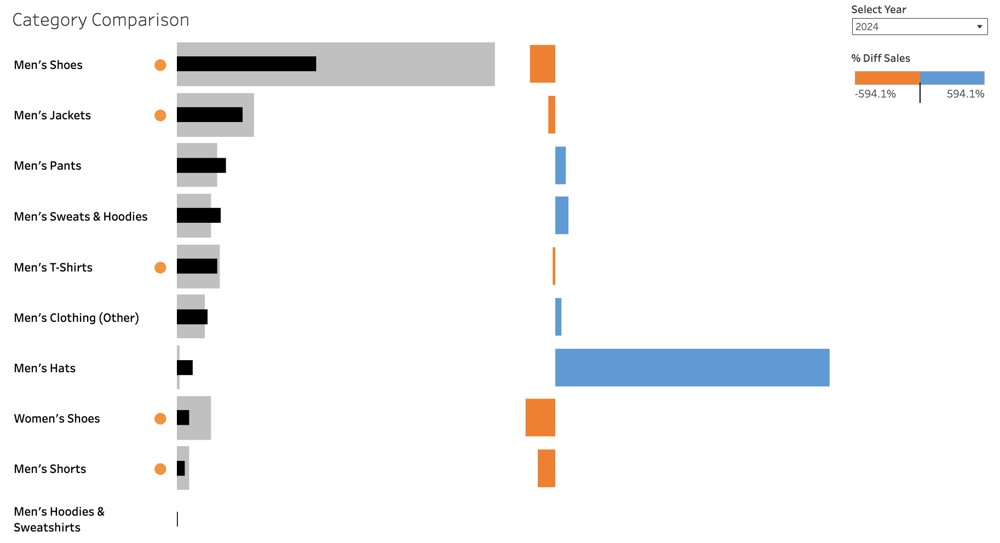

# E-commerce Analytics

# 1: ASK  
The **Ask** phase aims to determine and define the question that needs to be addressed and to understand stakeholder expectations. This process sets the foundation for the rest of the data analysis.  

## 1.1: Define the Business Objective  
This analysis aims to explore my sales data from eBay, an e-commerce marketplace, to gain insights into increasing sales. A glance at the data reveals a significant drop in sales from **Q3 to Q4** over the past four years. Various factors influence buyer decisions in e-commerce, but this analysis will focus on **seasonal sales trends** to provide actionable insights for boosting Q4 sales and preventing a sharp decline.  

## 1.2: Key Stakeholders  
Since this is my business and data, I am the sole stakeholder in this analysis.  

## 1.3: Guiding Questions   
- **Which categories contribute most to revenue and overall sales performance?**  
- **Does offering free shipping influence total revenue and profit?**    
- **What periods (months, weeks, or days) see the highest and lowest sales?
- **How do seasonality and specific holidays/events (e.g., Black Friday, Christmas, Back-to-School) impact purchasing behavior?**  

---

# 2: PREPARE  
In the **Prepare** phase, we examine the data to assess its **structure, credibility, and relevance** for answering the business questions.  

## 2.1: Data Source  
- **Name**: eBay Sales Data  
- **Source**: My personal sales data  
- **Description**: This dataset contains my personal sales data from **January 2021 to September 2024**. Each row represents an item sold during this period, including variables such as:  
  - **Transaction details**: Transaction date, type, order number  
  - **Location information**: City, state, zip code, country  
  - **Financials**: Net amount, item subtotal, shipping & handling, collected tax, final value fees (fixed & variable), international fees, and gross transaction amount  
  - **Product details**: Item ID, item title, quantity, and category  

## 2.2: Downloading the Data  
For this case study, **Python (Pandas)** will be the main tool for data analysis. The dataset will be used in **CSV format**, labeled as:  
- `eBay_Sales_Data.csv`  

## 2.3: Data Credibility and ROCCC Assessment  
I will use the **ROCCC** framework to assess the dataset's reliability and potential biases.  

- **Reliable**: ✅ Yes, the dataset comes directly from my eBay sales records.  
- **Original**: ✅ Yes, the dataset is a first-party data source, not third-party or estimated data.  
- **Comprehensive**: ✅ Yes, the dataset covers a broad range of performance factors, providing enough information to create reliable insights.  
- **Current**: ✅ Yes, the dataset includes data from the past **four years (2021–2024)**.  
- **Cited**: ✅ Yes, the data is properly sourced and reliable.  

---

# 3: PROCESS  
In the **Process** phase, we ensure our data is clean by correcting or removing **inaccurate, corrupted, improperly formatted, duplicate, or incomplete entries** within the dataset.  

## 3.1: Reviewing Our Data in Python  
In this section, we will load and review the dataset using **Pandas** to check for:  
- Missing values  
- Duplicates  
- Data type inconsistencies  
- Formatting errors  

```python
import openpyxl
import pandas as pd

# Step 1: Load the data
df = pd.read_excel("/Users/matthewarucan/Desktop/eBay_Analysis.xlsx")

# View the first few rows of the dataframe to get an overview of the data
print(df.head())

# Check the data types of each column to identify any potential issues
print(df.dtypes)

# Step 2: Clean numeric columns
# List of columns that should be cleaned (e.g., to handle '--' as missing data)
columns_float = [
    'Net amount', 'Quantity', 'Item Subtotal', 'Shipping & Handling',
    'Collected Tax', 'Final Value Fee Fixed', 'Final Value Fee Variable',
    'International Fee', 'Gross Transaction Amount'
]

# Convert columns to object type first to avoid any downcasting issues
df[columns_float] = df[columns_float].astype('object')

# Replace '--' with 0, then convert columns to numeric, coercing errors and filling missing values with 0
df[columns_float] = df[columns_float].replace('--', 0)
df[columns_float] = df[columns_float].apply(pd.to_numeric, errors='coerce').fillna(0).astype(float)

# Step 3: Remove Duplicate Rows
# Remove any duplicate rows from the dataset to avoid redundancy
df = df.drop_duplicates()

# Step 4: Clean string columns
# Strip leading/trailing whitespace from string columns
df = df.apply(lambda x: x.str.strip() if x.dtype == "object" else x)

# Fill missing values in string columns with 'Unknown'
string_columns = ['City', 'State', 'Zip Code', 'Country']
df[string_columns] = df[string_columns].fillna('Unknown')

# Convert string columns to title case to standardize text format
df[string_columns] = df[string_columns].apply(lambda x: x.str.title())

# Optional: View cleaned data (for confirmation or debugging)
print(df.head())
```

# 4: ANALYZE
In this step, we calculate key metrics, analyze patterns, and summarize data to provide insights that address our business objectives.

## Which categories contribute most to revenue and overall sales performance?

```python
# Convert 'Transaction Date' to datetime format if not already done
df["Transaction Date"] = pd.to_datetime(df["Transaction Date"])

# Extract Year and Quarter from the transaction date
df["Year"] = df["Transaction Date"].dt.year
df["Quarter"] = df["Transaction Date"].dt.quarter

# Group by Year, Quarter, and Category, then sum the item subtotal
category_quarterly_subtotal = df.groupby(["Year", "Quarter", "Category"])["Item Subtotal"].sum().reset_index()

# Get top 5 categories per quarter for each year
top_categories_per_quarter = category_quarterly_subtotal.groupby(["Year", "Quarter"]).apply(
    lambda x: x.nlargest(2, "Item Subtotal")
).reset_index(drop=True)

# Display results
print(top_categories_per_quarter)
```

## Does offering free shipping influence total revenue and profit?
```python
# Create a new column: Free Shipping (True if Shipping & Handling Collected == 0)
df["Free Shipping"] = df["Shipping & Handling"] == 0

# Group by 'Free Shipping' and calculate total revenue (Net amount) and profit
shipping_impact = df.groupby("Free Shipping").agg(
    Total_Revenue=("Net amount", "sum"),
    Total_Profit=("Gross Transaction Amount", "sum"),
    Average_Order_Value=("Net amount", "mean"),
    Total_Orders=("Order Number", "count")
).reset_index()

# Display results
print(shipping_impact)
```

## What periods (months, weeks, or days) see the highest and lowest sales?
```python
# Extract relevant time-based features
df["Year"] = df["Transaction Date"].dt.year
df["Month"] = df["Transaction Date"].dt.month
df["Week"] = df["Transaction Date"].dt.isocalendar().week
df["DayOfWeek"] = df["Transaction Date"].dt.day_name()  # Get day as a string (e.g., Monday)

# Group by month and sum sales
monthly_sales = df.groupby("Month")["Net amount"].sum().reset_index()

# Find highest & lowest sales months
highest_month = monthly_sales.loc[monthly_sales["Net amount"].idxmax()]
lowest_month = monthly_sales.loc[monthly_sales["Net amount"].idxmin()]

print(f"Highest Sales Month: {highest_month}")
print(f"Lowest Sales Month: {lowest_month}")

# Group by month and sum sales
monthly_sales = df.groupby("Month")["Net amount"].sum().reset_index()

# Find highest & lowest sales months
highest_month = monthly_sales.loc[monthly_sales["Net amount"].idxmax()]
lowest_month = monthly_sales.loc[monthly_sales["Net amount"].idxmin()]

print(f"Highest Sales Month: {highest_month}")
print(f"Lowest Sales Month: {lowest_month}")

# Group by week and sum sales
weekly_sales = df.groupby("Week")["Net amount"].sum().reset_index()

# Find highest & lowest sales weeks
highest_week = weekly_sales.loc[weekly_sales["Net amount"].idxmax()]
lowest_week = weekly_sales.loc[weekly_sales["Net amount"].idxmin()]

print(f"Highest Sales Week: {highest_week}")
print(f"Lowest Sales Week: {lowest_week}")

# Group by week and sum sales
weekly_sales = df.groupby("Week")["Net amount"].sum().reset_index()

# Group by day of the week and sum sales
day_sales = df.groupby("DayOfWeek")["Net amount"].sum()

# Order days properly for better visualization
day_sales = day_sales.reindex(["Monday", "Tuesday", "Wednesday", "Thursday", "Friday", "Saturday", "Sunday"])

# Print the results
print(day_sales)
```

## How do seasonality and specific holidays/events (e.g., Black Friday, Christmas, Back-to-School) impact purchasing behavior?
```python
# Convert 'Transaction Date' to datetime if not already
df["Transaction Date"] = pd.to_datetime(df["Transaction Date"])

# Extract relevant time-based features
df["Year"] = df["Transaction Date"].dt.year
df["Month"] = df["Transaction Date"].dt.month
df["Day"] = df["Transaction Date"].dt.day

# Create event markers based on known holiday dates
df["Event"] = "Regular Day"  # Default category

# Define event dates
black_friday = ((df["Month"] == 11) & (df["Day"] >= 23) & (df["Day"] <= 29))  # Black Friday (last Fri of Nov)
christmas_season = ((df["Month"] == 12) & (df["Day"] >= 25))  # Mid-Dec to Christmas
back_to_school = ((df["Month"] == 8) | ((df["Month"] == 9) & (df["Day"] <= 15)))  # Aug to mid-Sep

# Assign event labels
df.loc[black_friday, "Event"] = "Black Friday"
df.loc[christmas_season, "Event"] = "Christmas"
df.loc[back_to_school, "Event"] = "Back to School"

# Group by event and calculate total revenue and profit
event_sales = df.groupby("Event").agg(
    Total_Revenue=("Net amount", "sum"),
    Total_Profit=("Gross Transaction Amount", "sum"),
    Average_Order_Value=("Net amount", "mean"),
    Total_Orders=("Order Number", "count")
).reset_index()

# Display results
print(event_sales)
```

# 5: SHARE
The Share phase of data analytics involves communicating our findings and insights effectively to stakeholders or decision-makers. This phase is critical because the value of our analysis depends on how well others understand and act on it.

## Guiding Question 1: Which categories contribute most to revenue and overall sales performance?

Men’s Shoes saw a 25% increase in sales from 2021 ($12,541.77) to 2022 ($15,671.12), followed by a significant 46% jump in 2023, reaching $22,908.86. However, sales dropped by 56% in 2024, with Men’s Shoes generating $10,044.13. Men’s Jackets and Men’s Pants showed more modest changes, with Men’s Jackets seeing a 43% increase from 2021 to 2022 and then a 12% decrease in 2023. Overall, Men’s Shoes consistently dominated, despite fluctuations in other categories.


[](https://public.tableau.com/views/eBay_Visualization/CategoryComparison?:language=en-US&:sid=&:redirect=auth&:display_count=n&:origin=viz_share_link)


## Guiding Question 2: Does offering free shipping influence total revenue and profit?

The data indicates that offering free shipping significantly boosts sales performance. Items with free shipping generated $97,511.74, more than double the revenue of $46,091.53 from items without free shipping, a 111% increase. Additionally, total orders for items with free shipping were 1,132, compared to just 499 for items without, a 127% increase. However, the average order value (AOV) for free shipping orders was slightly lower at $86.14, compared to $92.37 for non-free shipping orders, a 7% decrease. Overall, the data supports that free shipping effectively drives higher sales and order volume, despite a slight reduction in AOV.

## Guiding Question 3: What periods (months, weeks, or days) see the highest and lowest sales?

The sales analysis reveals distinct patterns in purchasing behavior. August had the highest sales at $19,054.46, while October recorded the lowest at $7,860.00, representing a 58% decrease. On a weekly level, Week 31 (late July to early August) led with $5,470.06, while Week 53 (the last week of the year) saw a dramatic drop to $282.66, marking a 95% decline. Regarding days of the week, Sunday topped sales with $21,343.19, closely followed by Saturday at $20,994.21. Midweek days performed well, with Wednesday generating $20,690.80. Sales remained relatively steady from Monday to Friday, ranging from $19,652.05 (Monday) to $20,690.80 (Wednesday). These trends highlight weekends and late summer as peak sales periods, while the end of the year, especially Week 53, sees a sharp decline in revenue.

## Guiding Question 4: How do seasonality and specific holidays/events (e.g., Black Friday, Christmas, Back-to-School) impact purchasing behavior?

An analysis of purchasing behavior across specific seasons and holidays reveals key trends. During the Back to School period (August to mid-September), total revenue reached $26,531.74 from 324 orders, with an average order value of $81.89. This represents a 22% increase in revenue compared to Regular Days, which saw $113,150.67 from 1,256 orders, averaging $90.09 per order. In contrast, Black Friday (late November) generated $2,484.60 from 32 orders, averaging $77.64 per order, reflecting a 91% decrease in revenue compared to Back to School. The Christmas season (late December) recorded $1,436.26 in revenue over 19 orders, with an average order value of $75.59, marking a 94% decrease from Back to School revenue. These findings highlight that the Back to School season significantly boosts sales, while Black Friday and Christmas have less of an impact. Interestingly, the average order value is highest on Regular Days, suggesting that customers tend to spend more outside major shopping events.

# 6: ACT
Based on the data analysis, several actionable strategies can be implemented to optimize my business sales in Q4 and drive long-term growth.

## 1. Enhance Focus on Top-Performing Categories
**Insight:** Men’s Shoes have consistently been the top-selling category, with Men’s Jackets and Men’s Pants also performing well.  
**Action:**
- **Q4 Promotions:** Introduce exclusive Q4 promotions for Men’s Shoes, Jackets, and Pants. Consider bundling these items or offering limited-time discounts to stimulate interest and urgency.
- **Inventory Management:** Ensure adequate stock levels of these high-demand items to meet potential increased demand during Q4 promotions.

## 2. Leverage Free Shipping to Boost Sales
**Insight:** Offering free shipping has led to more than double the revenue and orders compared to items without free shipping.  
**Action:**
- **Q4 Free Shipping Campaigns:** Implement free shipping promotions during Q4, especially around key shopping events like Black Friday and Cyber Monday, to encourage higher purchase volumes.
- **Threshold Incentives:** Set a minimum purchase amount to qualify for free shipping, encouraging customers to add more items to their carts.

## 3. Capitalize on Peak Shopping Periods
**Insight:** August (Q3) recorded the highest sales, while October (Q4) saw the lowest. Week 31 had peak sales, whereas Week 53 had the lowest.  
**Action:**
- **Early Q4 Promotions:** Launch marketing campaigns in early October to counteract the typical sales dip, perhaps by introducing 'Fall Specials' or 'Pre-Holiday Deals' to stimulate early Q4 sales.
- **Weekend Events:** Since weekends, particularly Sundays, have higher sales, schedule major promotions or in-store events on these days to maximize foot traffic and sales.

## 4. Strategically Utilize Holiday Events
**Insight:** The Back-to-School season significantly boosts sales, while Black Friday and Christmas have a less pronounced impact.  
**Action:**
- **Amplify Black Friday and Christmas Promotions:** Enhance marketing efforts and offer compelling deals during these periods to capture the holiday shopping spirit.
- **Exclusive In-Store Offers:** Introduce exclusive in-store promotions or limited-edition products during Black Friday to drive foot traffic, as in-store shopping has seen a resurgence.

## 5. Offer Discounts to Repeat Customers
**Insight:** Repeat customers are valuable for driving consistent sales and loyalty.  
**Action:**
- **Reward Repeat Purchases:** Offer targeted discounts to repeat customers based on their previous purchases or order frequency. For instance, provide a discount on their next purchase after a certain number of orders or a dollar threshold.
- **Exclusive Deals for Return Customers:** Send personalized discount codes to repeat customers for use during Q4, creating a sense of exclusivity and encouraging them to shop more frequently.


